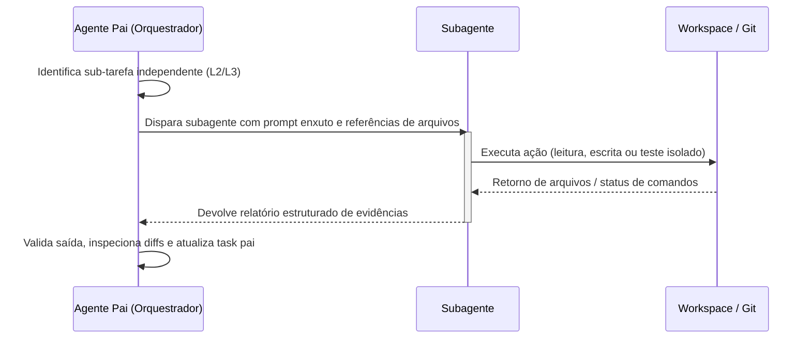

# Protocolo de Subagentes no l-nexus

Este documento estabelece as diretrizes de governança, isolamento e comunicação para subagentes disparados a partir de um agente orquestrador principal no ecossistema do **l-nexus**.

---

## 1. Princípios Fundamentais

1. **Escopo Único e Delimitado:** Cada subagente recebe uma missão específica e autossuficiente (pesquisa, codificação de um módulo, revisão ou execução de testes).
2. **Isolamento de Contexto:** Subagentes não devem herdar o histórico poluído da conversa do agente pai. O agente pai sintetiza e passa apenas o prompt e os caminhos de arquivos estritamente necessários.
3. **Contrato de Saída Estruturado:** Todo subagente deve responder com:
   - Status claro (`SUCESSO`, `FALHA`, `BLOQUEIO`).
   - Lista de arquivos criados ou modificados.
   - Log de evidências de testes/comandos executados.
   - Resumo das decisões tomadas.
   Quando a delegação vier do Orchestrator, escreva também `result.yaml` no run
   dir informado. O run dir é o contrato mecânico da execução; a janela do
   terminal é apenas o que o humano acompanha.
4. **Agregação na Task Pai:** O agente pai é o único responsável por atualizar o plano `.planning/` e consolidar as evidências no `Log de Evidências` da task principal.

---

## 2. Tipos de Subagentes Disponíveis

| Subagente | Template | Permissões de Escrita | Propósito |
|---|---|---|---|
| **Research** | `.ai/subagents/research.md` | Somente Leitura | Mapeamento de codebase, leitura de docs e investigação. |
| **Coder** | `.ai/subagents/coder.md` | Escrita no Workspace | Implementação de código e testes em escopo fechado. |
| **Reviewer** | `.ai/subagents/reviewer.md` | Somente Leitura | Revisão independente de conformidade (R2/R3), segurança e regras. |
| **QA / Tester** | `.ai/subagents/qa-tester.md` | Execução de Comandos | Execução de suíte de testes, cobertura e validação de regressão. |

Reviewer e QA/Tester **verificam**; nenhum dos dois corrige código. Um achado
volta ao Executor responsável através do agente pai. Para a coordenação completa
(gates, rework, upgrade e terminais visíveis), veja
`.ai/guidelines/core/orchestration.md`.

---

## 3. Fluxo de Delegação

---

## 4. Gestão de Isolamento (Branches & Worktrees)

- Para tarefas paralelas ou tarefas de alto risco (**R3**), o agente pai pode orientar o subagente a operar em uma *branch* dedicada ou *worktree* separada.
- Ao finalizar, o subagente reporta o branch/commit gerado para que o agente pai realize o merge ou abra o PR.
